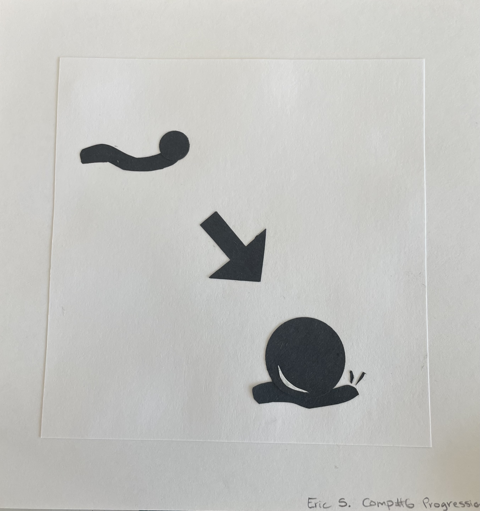

# **`Other Creative Projects through Colby`**

Through my liberal arts education at Colby, I have developed a strong creative ability, showcased through various projects. Courses like Sculpture and 2D Art have deepened my understanding of the creative process, allowing me to refine my artistic skills and explore intricate design techniques.

# **`Scupture Project`**

{width=200}
{width=200}
{width=200}
{width=200}

# **`2D Art Projects`**

{width=200}{height=200}
{width=200}{height=200}
{width=200}{height=200}
{width=200}{height=200}
{width=200}{height=200}
{width=200}{height=200}

