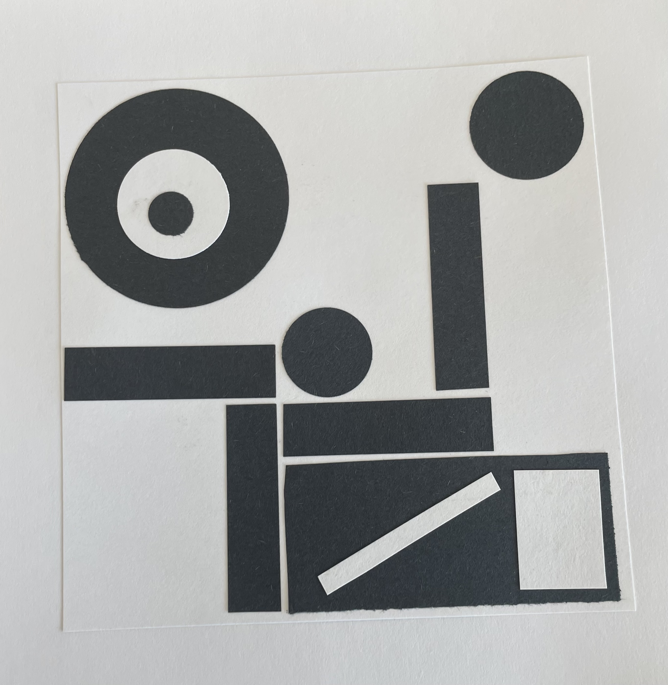

# **Other Creative Projects through Colby**

## **Scupture Project**

In my Sculpture class, I learned different joinery techniques and how they can be used in both design and art. 

### **Gravity-Defying Minimalist Table**

For my project, I wanted to make something both useful and creative that could attach to a structure, whether natural or man-made. I designed a sleek, minimalist table that seems to defy gravity. It rests on the lip of a window, turning an outdoor space into a functional surface. Even though it’s simple, I used joinery techniques like lapped and dowel joints. The dowel joint makes the leg detachable, making the table more convenient and versatile.

{width=200}
{width=200}
{width=200}
{width=200}

## **2D Art Projects**

### **Black and White**

This is a sampling of pieces I created for a class in 2D art.

{width=200}
{width=200}
{width=200}

{width=200}
{width=200}
{width=200}

