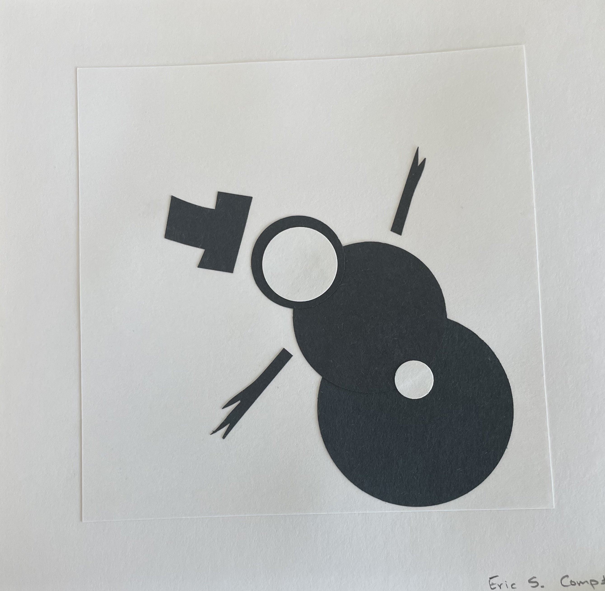

# **Traditional Media Portfolio**

## **Scupture Project**

In my Sculpture class, I learned different joinery techniques and how they can be used in both design and art. 

### **Lab and Dowel**

For a project in a sculpture course at Colby, I wanted to make something both useful and creative:  a new twist on a table.  I aimed for a minimalist design and a structure that would defy gravity.  The table rests on the sill of a window, turning an outdoor space into a functional surface. To achieve the simplicity, I used a carpenter’s joinery techniques like lapped and dowel joints. The dowel joint makes the leg detachable, making the table portable and easily stored.

{width=200}
{width=200}
{width=200}
{width=200}

## **2D Art Projects**

### **Black and White**

This is a sampling of pieces I created for a class in 2D art.

{width=200}
{width=200}
{width=200}

{width=200}
{width=200}
{width=200}

