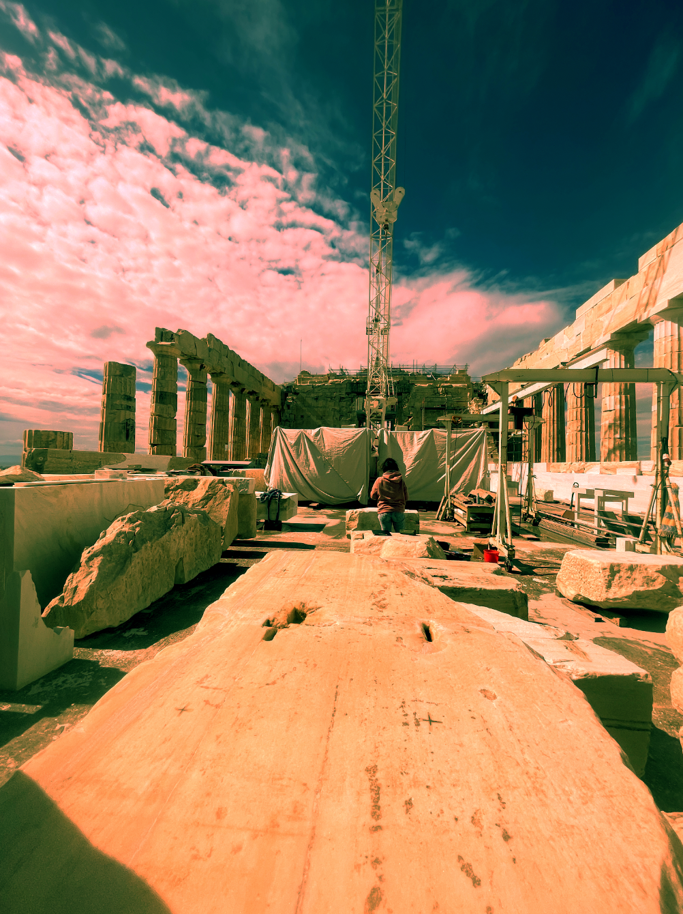
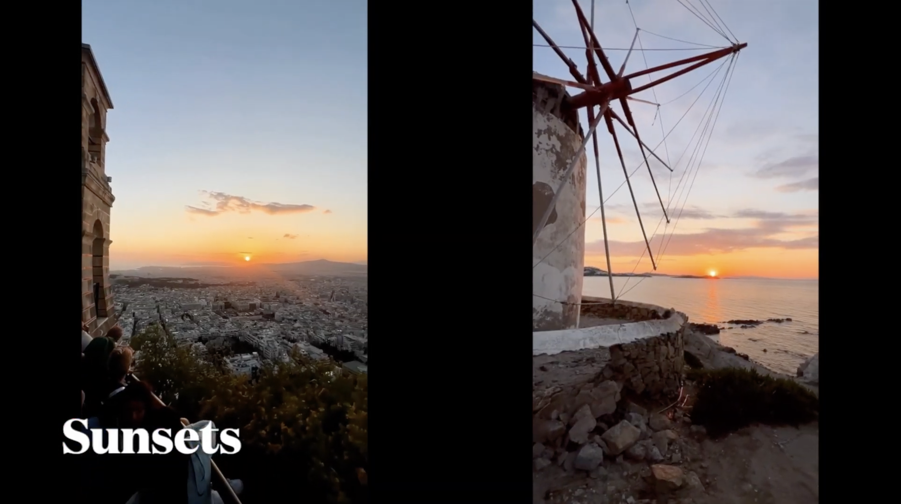

# **Digital Media Portfolio**
## **Movie Theater App**

{align=left width=250 loading=lazy}

I created this portfolio as a part of Google’s seven-course series in UX/UI design on Coursera.  The portfolio illustrates not only my design of an e-commerce app using Figma, but also the steps in my design process, from ideation and building wireframes to prototyping, UX research, and concept testing. 

[Check out my work!](pdfs/Grad_School_Portfolio.pdf){ .md-button }

 

## **Digital Art Projects**

{align=left width=250 loading=lazy}

This diverse set includes selections of my work with Adobe Photoshop, Illustrator, and InDesign.

[Check out my work!](pdfs/Digital_Art_Portfolio.pdf){ .md-button }

 

## **Animations**

### **Stop-Motion Animation**
{align=left width=250 loading=lazy}

Inspired by anime, this animation incorporates impact frames and explores creative transitions as part of a practice in dynamic motion.

[Check out my work!](https://drive.google.com/drive/folders/1mctkOgxRClk1RI39yJSUwBtmnqly8qgb?usp=sharing){ .md-button }

 

### **Architectural Animation**

{align=left width=250 loading=lazy}

Inspired by the strength and elegance of Ancient Greek architecture, my work explores the relationship between structure and space, presence and absence. I am particularly drawn to how these ancient forms use negative space—not just as emptiness, but as something that gives meaning and definition to what surrounds it. This interplay creates a quiet tension that I find both powerful and reflective.
My artistic process begins with hand-drawn sketches of Ancient Greek buildings, where I focus on the precision, symmetry, and balance that define classical architecture. After completing these sketches, I digitize and layer them using Adobe Photoshop, treating each layer as a frame in a larger sequence. Through this technique, I’m able to create an animation that eventually reveals each structure. The slow movement allows the viewer to engage with the form over time, experiencing the architecture as something dynamic rather than static.
Ultimately, my work aims to highlight the emotional and aesthetic resonance of architectural space. By emphasizing both what is shown and what is withheld, I hope to invite viewers to reflect on the role of absence in shaping meaning—and to consider how even the spaces in between can carry weight.

[Check out my work!](https://drive.google.com/drive/folders/1iEdY2Z1K_nGf7YbJmTB1vCbThUHmz-2n?usp=sharing){ .md-button }

 

### **Rotoscope Animations**

{align=left width=250 loading=lazy}
{align=left width=250 loading=lazy}

 

## **Website Design**

{align=left width=250 loading=lazy}
{align=left width=250 loading=lazy}
 
{align=left width=250 loading=lazy}
{align=left width=250 loading=lazy}

 

## **Experimental Films**

{align=left width=250 loading=lazy}

These films explore the exciting—and at times perplexing—world of experimental film and video, which defies the traditional narrative expectations of story and exposition.

[Check out my work!](https://drive.google.com/drive/folders/1OgCBCWV1STe2ityFg_Fe9g0NcV_e_zIa?usp=sharing){ .md-button }

 