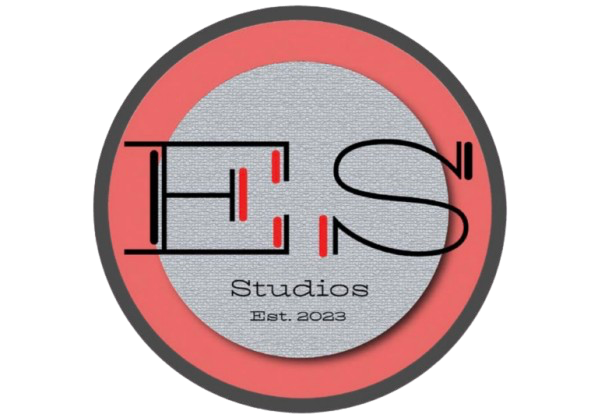

# **Digital Media Portfolio**
## **Movie Theater App**

{align=left width=250 loading=lazy}

I created this portfolio as a part of Google’s seven-course series in UX/UI design on Coursera.  The portfolio illustrates not only my design of an e-commerce app using Figma, but also the steps in my design process, from ideation and building wireframes to prototyping, UX research, and concept testing. 

[Check out my work!](pdfs/Grad_School_Portfolio.pdf){ .md-button }

 

## **Digital Art Projects**

{align=left width=250 loading=lazy}

This diverse set includes selections of my work with Adobe Photoshop, Illustrator, and InDesign.

[Check out my work!](pdfs/Digital_Art_Portfolio.pdf){ .md-button }

 

## **Animations**

{align=left width=250 loading=lazy}

