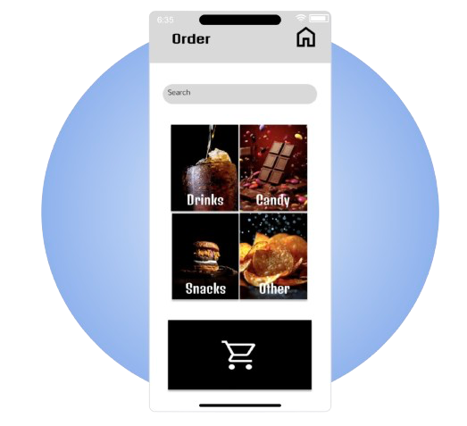

# **Digital Media Portfolio**
## **Movie Theater App**

{align=left width=250 loading=lazy}

I created this portfolio as a part of Google’s seven-course series in UX/UI design on Coursera.  The portfolio illustrates not only my design of an e-commerce app using Figma, but also the steps in my design process, from ideation and building wireframes to prototyping, UX research, and concept testing. 

[Check out my work!](pdfs/Grad_School_Portfolio.pdf){ .md-button }

 

## **Digital Art Projects**

{align=left width=250 loading=lazy}

This diverse set includes selections of my work with Adobe Photoshop, Illustrator, and InDesign.

[Check out my work!](pdfs/Digital_Art_Portfolio.pdf){ .md-button }

 

## **Animations**
### **Architectural Animation**

{align=left width=250 loading=lazy}

This diverse set includes selections of my work with Adobe Photoshop, Illustrator, and InDesign.

[Check out my work!](pdfs/Digital_Art_Portfolio.pdf){ .md-button }

 

### **Rotoscope Animation**

{align=left width=250 loading=lazy}
{align=left width=250 loading=lazy}

 

### **Stop-Motion Animation**

[Check out my work!](https://drive.google.com/drive/folders/1mctkOgxRClk1RI39yJSUwBtmnqly8qgb?usp=sharing){ .md-button }

## **Experimental Films**

{align=left width=250 loading=lazy}

This diverse set includes selections of my work with Adobe Photoshop, Illustrator, and InDesign.

[Check out my work!](https://drive.google.com/drive/folders/1OgCBCWV1STe2ityFg_Fe9g0NcV_e_zIa?usp=sharing){ .md-button }

 

## **Website Design**
